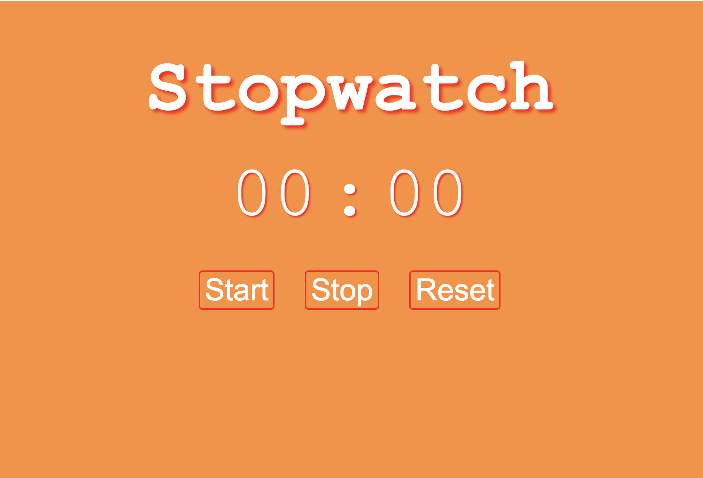
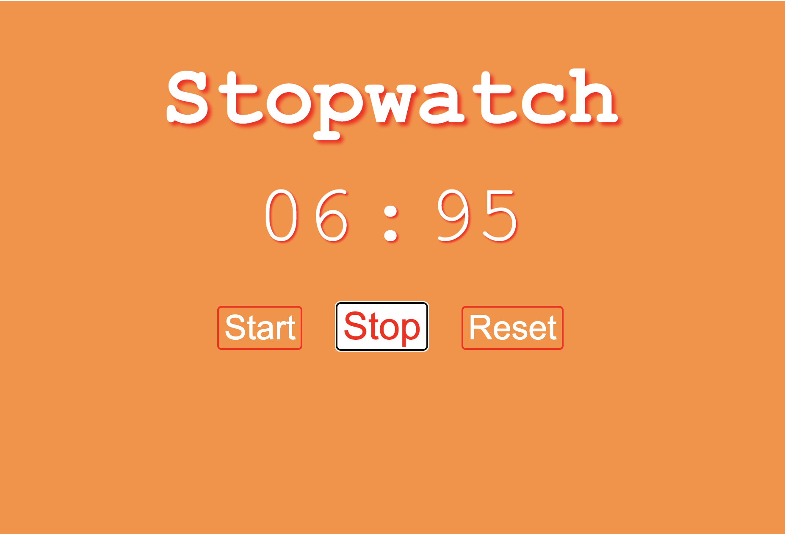

# Stopwatch ⌚️

## Objective:
The objective for this project was to design a simple stopwatch, using HTML, CSS, and Javascript.

## Description:
The stopwatch was designed to be simple and easy to use. The stopwatch measures the time by minutes and seconds. Click the start button to begin the timer, and the stop button to pause the timer. The reset button will clear the time. 

#

Link to deployed application: https://lizf57.github.io/stopwatch/

